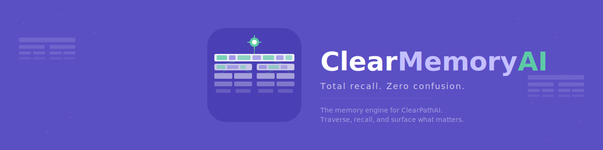

<p align="center">
  
</p>

<p align="center">
  <strong>Total recall. Zero confusion.</strong><br/>
  <sub>The memory engine for ClearPathAI. Traverse, recall, and surface what matters.</sub>
</p>

<p align="center">
  
  
  
  
</p>

---

## What is ClearMemoryAI?

ClearMemoryAI is the dedicated memory and context management tool for the ClearPathAI ecosystem. It handles how AI agents store, traverse, recall, and surface knowledge — so your team always has the right context at the right time.

Think of ClearPathAI as the compass that guides you, and ClearMemoryAI as the map it reads from.

## Features

- 🧠 **Deep memory traversal** — Navigate layered knowledge structures to find exactly what you need
- 🔍 **Instant recall** — Surface relevant context from past sessions, decisions, and conversations
- 🗂️ **Structured storage** — Organize knowledge in traversable data trees, not flat files
- 🔗 **ClearPathAI integration** — Seamlessly powers memory for all ClearPathAI agents and workflows

## Getting Started

```bash
# Clone the repo
git clone https://github.com/your-username/clearmemoryAI.git
cd clearmemoryAI

# Install dependencies
npm install

# Run in development
npm run dev
```

## Project Structure

```
clearmemoryAI/
├── assets/
│   ├── icons/
│   │   ├── favicon.ico          # Browser tab icon
│   │   ├── icon-16.png          # 16x16 favicon
│   │   ├── icon-32.png          # 32x32 favicon
│   │   ├── icon-64.png          # 64x64 icon
│   │   ├── icon-128.png         # 128x128 icon
│   │   ├── icon-256.png         # 256x256 icon
│   │   ├── icon-512.png         # 512x512 app icon
│   │   └── icon-512.svg         # Vector source icon
│   └── logos/
│       ├── logo-full.svg        # Full data stack + wordmark (marketing)
│       ├── logo-navbar.svg      # Horizontal icon + wordmark (header)
│       ├── logo-footer.svg      # Small icon + wordmark + motto (footer)
│       ├── logo-wordmark.svg    # Text-only wordmark
│       └── github-banner.svg    # README banner
├── components/
│   ├── LogoComponents.jsx       # NavbarLogo & FooterLogo components
│   ├── brand-tokens.js          # Colors, fonts, tagline constants
│   ├── electron-icon-setup.js   # Electron main process config
│   └── head-snippet.html        # HTML <head> meta/favicon tags
├── main.js
├── package.json
└── README.md
```

## Brand Colors (shared with ClearPathAI)

| Role | Color | Hex |
|------|-------|-----|
| Primary (background) | 🟣 Purple | `#5B4FC4` |
| "Memory" text | 🟣 Light purple | `#7F77DD` |
| "AI" text / accent | 🟢 Teal | `#1D9E75` |
| Traversal lines / beacon | 🟢 Light teal | `#5DCAA5` |
| Data blocks | 🔵 Neural blue | `#85B7EB` |

## Part of the Clear Family

| Product | Purpose |
|---------|---------|
| **ClearPathAI** | AI-powered compass — navigate complexity with confidence |
| **ClearMemoryAI** | Memory engine — traverse, recall, and surface knowledge |

## License

MIT
